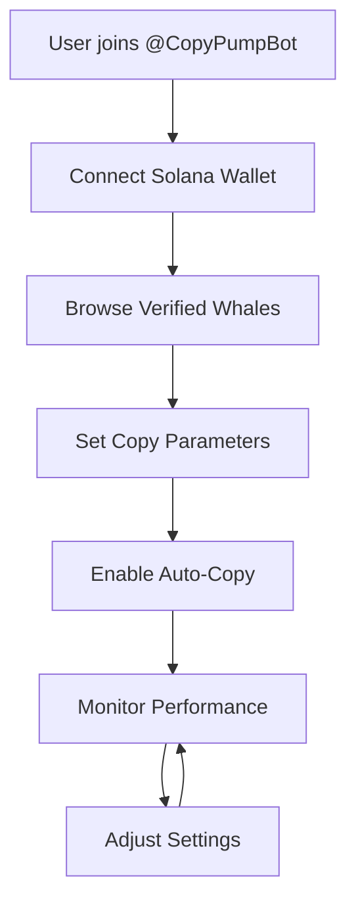

# copypump
🔁 Copy trade like a pro. 🐋 Track whales. 💸 Zero fees for holders. ⚡️ One-tap reset. Built on Solana.
# CopyPump Whitepaper


**Version 1.0 | January 2025**

---

## Abstract

CopyPump represents the next evolution in decentralized copy trading, leveraging Telegram's ubiquitous messaging platform to democratize access to profitable trading strategies. Our innovative bot automatically mirrors the trades of verified whale wallets, enabling retail investors to benefit from institutional-level trading expertise without the complexity of traditional copy trading platforms.

## Table of Contents

- [1. Introduction](#1-introduction)
- [2. Market Analysis](#2-market-analysis)
- [3. The CopyPump Solution](#3-the-copypump-solution)
- [4. Technical Architecture](#4-technical-architecture)
- [5. Token Economics](#5-token-economics)
- [6. Whale Verification System](#6-whale-verification-system)
- [7. Security Framework](#7-security-framework)
- [8. Roadmap](#8-roadmap)
- [9. Team](#9-team)
- [10. Risk Factors](#10-risk-factors)
- [11. Conclusion](#11-conclusion)

---

## 1. Introduction

### 1.1 Executive Summary

The cryptocurrency trading landscape has evolved dramatically, yet a significant gap remains between sophisticated institutional traders and retail investors. CopyPump bridges this divide by providing seamless, automated copy trading functionality through Telegram, the world's most popular messaging platform for crypto communities.

### 1.2 Problem Statement

**Current Market Challenges:**
- 📊 **Information Asymmetry**: Retail traders lack access to institutional-grade research and strategies
- ⏱️ **Timing Disadvantage**: Manual trading cannot compete with algorithmic execution speeds
- 🔍 **Whale Discovery**: Identifying consistently profitable traders is time-intensive and unreliable
- 💻 **Platform Complexity**: Existing copy trading solutions require extensive technical knowledge
- 💰 **High Barrier to Entry**: Traditional platforms impose minimum investment requirements

### 1.3 Our Vision

To democratize profitable trading strategies by making whale-level performance accessible to every crypto investor through intuitive, automated copy trading.

---

## 2. Market Analysis

### 2.1 Market Size and Opportunity

| Metric | Value | Growth Rate |
|--------|-------|-------------|
| Global Copy Trading Market | $2.2B (2024) | 12.9% CAGR |
| Crypto Trading Volume | $14.5T (2024) | 8.3% YoY |
| Telegram Monthly Active Users | 900M+ | 15% YoY |
| DeFi Total Value Locked | $45B+ | Variable |

### 2.2 Competitive Landscape

**Traditional Copy Trading Platforms:**
- eToro, ZuluTrade, NAGA
- **Limitations**: Centralized, limited crypto exposure, complex interfaces

**Crypto-Native Solutions:**
- 3Commas, Bitget Copy Trading, OKX Copy Trading
- **Limitations**: Platform-specific, limited wallet integration, high fees

**CopyPump Advantages:**
- ✅ Telegram-native interface
- ✅ Non-custodial architecture
- ✅ Solana-based (low fees, high speed)
- ✅ AI-powered whale verification
- ✅ Zero fees for early adopters

---

## 3. The CopyPump Solution

### 3.1 Core Features

#### 🎯 One-Tap Trading Control
- Instant trade execution through Telegram commands
- Customizable risk parameters
- Real-time position monitoring
- Emergency stop functionality

#### 🐋 Elite Whale Tracking
- AI-driven whale identification algorithm
- Historical performance analysis
- Risk-adjusted return metrics
- Transparency through on-chain verification

#### 💎 Zero Fees for Early Holders
- First 60 days completely fee-free
- Performance-based fee structure post-launch
- No hidden costs or subscription fees

#### 📈 Daily Whale Recommendations
- Curated daily insights
- Performance league tables
- Strategy analysis reports
- Market condition adaptability

### 3.2 User Journey



### 3.3 Value Proposition

| User Type | Traditional Method | CopyPump Advantage |
|-----------|-------------------|-------------------|
| **Beginner** | Manual learning curve | Instant professional strategies |
| **Intermediate** | Time-intensive research | AI-curated whale selection |
| **Advanced** | Portfolio fragmentation | Unified Telegram interface |
| **Institutional** | Custom development | Plug-and-play integration |

---

## 4. Technical Architecture

### 4.1 System Overview

```
┌─────────────────┐    ┌─────────────────┐    ┌─────────────────┐
│   Telegram Bot  │    │  Core Engine    │    │ Solana Network  │
│                 │    │                 │    │                 │
│ • User Interface│◄──►│ • Trade Logic   │◄──►│ • Smart Contracts│
│ • Commands      │    │ • Risk Management│   │ • Token Swaps   │
│ • Notifications │    │ • Whale Tracking│    │ • Wallet Connect│
└─────────────────┘    └─────────────────┘    └─────────────────┘
         │                       │                       │
         ▼                       ▼                       ▼
┌─────────────────┐    ┌─────────────────┐    ┌─────────────────┐
│   Database      │    │  AI Analytics   │    │  External APIs  │
│                 │    │                 │    │                 │
│ • User Profiles │    │ • Whale Scoring │    │ • Price Feeds   │
│ • Trade History │    │ • Pattern Recog │    │ • Market Data   │
│ • Performance   │    │ • Risk Analysis │    │ • DEX Routing   │
└─────────────────┘    └─────────────────┘    └─────────────────┘
```

### 4.2 Smart Contract Architecture

#### 4.2.1 Core Contracts

**CopyPumpFactory.sol**
```solidity
contract CopyPumpFactory {
    mapping(address => address) public userVaults;
    mapping(address => bool) public verifiedWhales;
    
    function createUserVault() external returns (address vault);
    function verifyWhale(address whale) external onlyOwner;
    function executeWhaleStrategy(address whale, bytes calldata data) external;
}
```

**UserVault.sol**
```solidity
contract UserVault {
    address public owner;
    mapping(address => uint256) public allocations;
    uint256 public maxSlippage;
    uint256 public stopLoss;
    
    function copyTrade(address token, uint256 amount) external onlyAuthorized;
    function setRiskParameters(uint256 _maxSlippage, uint256 _stopLoss) external onlyOwner;
}
```

### 4.3 Whale Detection Algorithm

#### 4.3.1 Scoring Methodology

**Performance Metrics (40%)**
- Annualized returns
- Sharpe ratio
- Maximum drawdown
- Win rate

**Risk Assessment (30%)**
- Portfolio diversification
- Position sizing consistency
- Correlation to market

**Consistency Factors (20%)**
- Trading frequency
- Strategy adherence
- Behavioral patterns

**Volume Requirements (10%)**
- Minimum portfolio size: $100K
- Average trade size: $10K+
- Trading history: 6+ months

#### 4.3.2 Real-Time Monitoring

```python
class WhaleMonitor:
    def __init__(self):
        self.performance_threshold = 0.15  # 15% annual return
        self.risk_threshold = 0.25        # 25% max drawdown
        self.consistency_window = 90      # 90-day rolling window
    
    def evaluate_whale(self, wallet_address):
        performance = self.calculate_performance(wallet_address)
        risk = self.assess_risk_metrics(wallet_address)
        consistency = self.analyze_consistency(wallet_address)
        
        score = (performance * 0.4) + (risk * 0.3) + (consistency * 0.3)
        return score > self.minimum_score_threshold
```

---

## 5. Token Economics

### 5.1 Token Overview

**Token Name**: CopyPump Token  
**Symbol**: $PUMP  
**Blockchain**: Solana  
**Total Supply**: 1,000,000,000 PUMP  
**Token Standard**: SPL Token  

### 5.2 Token Distribution

```
🥧 Token Allocation:
├── 40% - Public Sale & Liquidity
├── 25% - Community Rewards & Airdrops  
├── 15% - Development Fund
├── 10% - Team (24-month vesting)
├── 5% - Marketing & Partnerships
└── 5% - Reserve Fund
```

### 5.3 Utility Functions

#### 5.3.1 Fee Reduction Tiers

| Tier | PUMP Holdings | Trading Fee | Premium Features |
|------|---------------|-------------|-----------------|
| Bronze | 0 - 10K | 1% | Basic copy trading |
| Silver | 10K - 50K | 0.75% | Advanced analytics |
| Gold | 50K - 200K | 0.5% | Priority whale access |
| Platinum | 200K+ | 0.25% | Custom strategies |

#### 5.3.2 Staking Rewards

**Staking Pool Structure:**
- **Lock Period**: 30, 90, 180, 365 days
- **APY Range**: 8% - 25% based on lock duration
- **Rewards Source**: Trading fees, token inflation (2% annually)
- **Additional Benefits**: Governance voting, early feature access

### 5.4 Deflationary Mechanisms

**Quarterly Token Burns:**
- 25% of protocol revenue used for buybacks
- Tokens permanently removed from circulation
- Burn events announced 7 days in advance
- Transparency through on-chain verification

---

## 6. Whale Verification System

### 6.1 Multi-Stage Verification Process

#### Stage 1: Automated Screening
- **Portfolio Analysis**: Minimum $100K total value
- **Performance History**: 6+ months of trading data
- **Risk Metrics**: Maximum 30% drawdown threshold
- **Activity Level**: Minimum 50 trades in evaluation period

#### Stage 2: AI Performance Evaluation
```python
def evaluate_whale_performance(wallet_address):
    metrics = {
        'total_return': calculate_total_return(wallet_address),
        'sharpe_ratio': calculate_sharpe_ratio(wallet_address),
        'max_drawdown': calculate_max_drawdown(wallet_address),
        'win_rate': calculate_win_rate(wallet_address),
        'consistency': calculate_consistency_score(wallet_address)
    }
    
    weighted_score = (
        metrics['total_return'] * 0.25 +
        metrics['sharpe_ratio'] * 0.25 +
        (1 - metrics['max_drawdown']) * 0.20 +
        metrics['win_rate'] * 0.15 +
        metrics['consistency'] * 0.15
    )
    
    return weighted_score > VERIFICATION_THRESHOLD
```

#### Stage 3: Manual Review
- **Strategy Analysis**: Evaluation by trading experts
- **Behavioral Assessment**: Consistency in trading patterns
- **Risk Management**: Adherence to position sizing rules
- **Community Feedback**: Reputation within crypto community

### 6.2 Ongoing Monitoring

**Real-Time Performance Tracking:**
- Daily P&L calculations
- Risk metric updates
- Deviation from historical patterns
- Automatic de-listing triggers

**Monthly Review Process:**
- Performance benchmark comparison
- Strategy evolution analysis
- User feedback integration
- Whale ranking adjustments

---

## 7. Security Framework

### 7.1 Smart Contract Security

#### 7.1.1 Security Measures

**Code Audits:**
- Pre-deployment audits by leading security firms
- Formal verification of critical functions
- Bug bounty program with up to $100K rewards
- Continuous monitoring post-deployment

**Access Controls:**
```solidity
modifier onlyAuthorized() {
    require(
        msg.sender == owner || 
        authorizedOperators[msg.sender] ||
        msg.sender == address(copyPumpBot),
        "Unauthorized access"
    );
    _;
}

modifier validWhale(address whale) {
    require(verifiedWhales[whale], "Whale not verified");
    require(whalePerformance[whale].isActive, "Whale inactive");
    _;
}
```

#### 7.1.2 Risk Mitigation

**Circuit Breakers:**
- Maximum daily loss limits
- Position size restrictions
- Automatic trading halts during extreme volatility
- Emergency pause functionality

**Fund Protection:**
- Multi-signature wallets for treasury
- Time-locked upgrades (48-hour delay)
- Separate hot/cold wallet architecture
- Insurance fund for extreme events

### 7.2 User Security

#### 7.2.1 Wallet Integration

**Non-Custodial Architecture:**
- Users maintain full control of private keys
- Limited trading permissions only
- Revocable authorization at any time
- No fund custody by CopyPump

**Supported Wallets:**
- Phantom
- Solflare  
- Backpack
- Coinbase Wallet
- Hardware wallets (Ledger, Trezor)

#### 7.2.2 Privacy Protection

**Data Minimization:**
- Only necessary trading data collected
- No personal information required
- Anonymous wallet tracking
- GDPR compliance for EU users

---

## 8. Roadmap

### 8.1 Phase 1: Foundation (Q1 2025)

**MVP Launch** ✅
- [x] Telegram bot development
- [x] Basic copy trading functionality
- [x] Solana integration
- [x] Initial whale verification system

**Security & Audits** 🔄
- [ ] Smart contract audits
- [ ] Penetration testing
- [ ] Bug bounty program launch
- [ ] Security documentation

### 8.2 Phase 2: Enhancement (Q2 2025)

**Advanced Features**
- [ ] Multi-whale portfolio copying
- [ ] Custom risk parameter controls
- [ ] Advanced analytics dashboard
- [ ] Mobile app development

**Community Building**
- [ ] Token generation event
- [ ] Staking program launch
- [ ] Governance token distribution
- [ ] Partnership announcements

### 8.3 Phase 3: Expansion (Q3 2025)

**Multi-Chain Support**
- [ ] Ethereum integration
- [ ] BSC support
- [ ] Polygon network
- [ ] Cross-chain bridge development

**Institutional Features**
- [ ] API access for institutions
- [ ] White-label solutions
- [ ] Advanced reporting tools
- [ ] Compliance framework

### 8.4 Phase 4: Ecosystem (Q4 2025)

**DeFi Integration**
- [ ] Yield farming strategies
- [ ] Liquidity pool optimization
- [ ] Options and derivatives
- [ ] Automated rebalancing

**Global Expansion**
- [ ] Multi-language support
- [ ] Regional compliance
- [ ] Local partnerships
- [ ] Educational content program

---

## 9. Team

### 9.1 Core Team

**Technical Leadership**
- **CTO**: 8+ years blockchain development, former Solana Labs
- **Lead Developer**: Full-stack expertise, DeFi protocol experience
- **Security Engineer**: Smart contract auditing background
- **DevOps Engineer**: Infrastructure scaling specialist

**Business Development**
- **CEO**: Former crypto exchange executive
- **Head of Marketing**: Growth hacking for crypto startups
- **Community Manager**: Telegram/Discord community building
- **Partnerships Lead**: DeFi ecosystem connections

### 9.2 Advisory Board

- **DeFi Protocol Founder**: Strategic product guidance
- **Former Market Maker**: Institutional trading insights  
- **Regulatory Expert**: Compliance and legal framework
- **Venture Capital Partner**: Fundraising and scaling advice

### 9.3 Development Philosophy

**Agile Methodology:**
- 2-week sprint cycles
- Continuous user feedback integration
- Rapid iteration and improvement
- Community-driven feature prioritization

---

## 10. Risk Factors

### 10.1 Technical Risks

**Smart Contract Vulnerabilities**
- *Mitigation*: Multiple audits, formal verification, bug bounties

**Scalability Challenges** 
- *Mitigation*: Solana's high throughput, layer-2 integration plans

**Integration Dependencies**
- *Mitigation*: Multiple DEX partnerships, fallback mechanisms

### 10.2 Market Risks

**Regulatory Changes**
- *Mitigation*: Legal compliance, geographical diversification

**Whale Performance Degradation**
- *Mitigation*: Continuous monitoring, automatic de-listing

**Market Manipulation**
- *Mitigation*: Multi-source verification, anomaly detection

### 10.3 Operational Risks

**Team Concentration**
- *Mitigation*: Knowledge documentation, team expansion

**Platform Dependencies**
- *Mitigation*: Multi-platform strategy, backup systems

**Security Breaches**
- *Mitigation*: Defense-in-depth, incident response plans

---

## 11. Conclusion

### 11.1 Market Opportunity

The convergence of institutional trading strategies with retail accessibility represents a massive market opportunity. CopyPump is positioned to capture significant market share through its unique combination of:

- **Platform Ubiquity**: Telegram's 900M+ user base
- **Technical Excellence**: Solana's performance advantages  
- **User Experience**: One-tap trading simplicity
- **Economic Alignment**: Performance-based fee structure

### 11.2 Competitive Advantages

**Sustainable Moats:**
1. **Network Effects**: More users attract better whales
2. **Data Advantage**: Proprietary whale performance database
3. **Platform Integration**: Deep Telegram ecosystem ties
4. **Community Strength**: Token-aligned stakeholder interests

### 11.3 Success Metrics

**Year 1 Targets:**
- 50,000+ active users
- $100M+ in copied trade volume
- 100+ verified whale traders
- 85%+ user satisfaction rate

### 11.4 Long-Term Vision

CopyPump envisions becoming the definitive platform for democratized trading strategies, where any investor can access institutional-grade performance through simple, secure, and cost-effective copy trading solutions.

---

## Appendices

### Appendix A: Technical Specifications

**Telegram Bot Capabilities:**
- Real-time trade notifications
- Portfolio performance tracking
- Risk management controls
- Whale discovery and analytics
- One-tap trade execution

**Solana Integration:**
- SPL token support
- Jupiter DEX aggregation
- Serum order book access
- Raydium liquidity pools
- Custom program deployment

### Appendix B: Legal Disclaimer

*This whitepaper is for informational purposes only and does not constitute investment advice, financial advice, trading advice, or any other sort of advice. You should not treat any of the document's content as such. CopyPump does not recommend that any cryptocurrency should be bought, sold, or held by you. Conduct your own due diligence and consult your financial advisor before making any investment decisions.*

### Appendix C: References

1. "State of Copy Trading 2024" - FinTech Research Institute
2. "Decentralized Finance: Opportunities and Risks" - Bank for International Settlements
3. "Telegram Ecosystem Analysis" - Crypto Research Group
4. "Solana Performance Benchmarks" - Blockchain Scalability Report

---

**Contact Information:**
- Website: [copypump.io](https://copypump.io)
- Telegram: [@CopyPumpBot](https://t.me/Copypumpbot)
- Twitter: [@CopyPumpBot](https://x.com/Copypumpbot)
- Email: team@copypump.io

**Last Updated**: January 2025  
**Document Version**: 1.0
